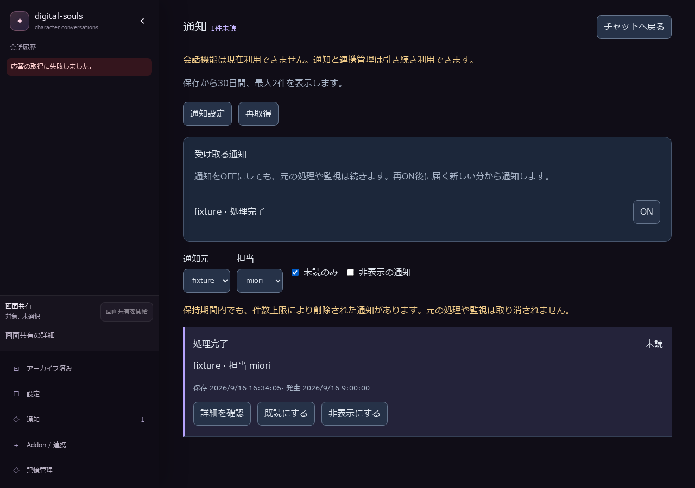
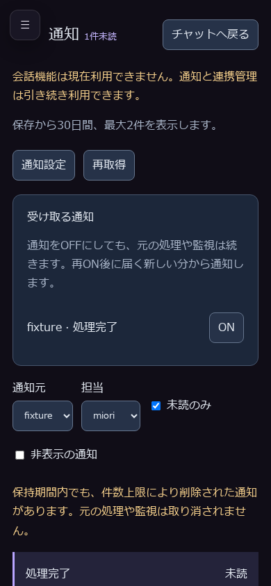

# 通知基盤の適合検証（2026-09-16）

対象ソース：`f1764757cfe005e2d44bd0bef66cd1f74da0d460`。
実行結果：[browser-conformance.json](browser-conformance.json)。
対象ファイルのSHA-256を実行前後で照合している。

本番`app.main`のlifespan・APIと、共有Gate、別プロセスのMCP fixture、実ブラウザを通す。
試験用hostの追加機能は配送位置の観測だけであり、本番の初期化を置き換えない。
HTTP通信の差し替え、LLM、会話、音声サービスは使用しない。
独立した一時データ領域を使用し、既存dev／dogfoodを操作しない。

## 確認結果

6項目成功：

- 会話なし・LLM未構成で個別通知を保存・表示。
- 画面を閉じた間の保存と件数上限（試験では2件）。
- 内容のsanitize、詳細取得だけでは未読を維持、明示既読。
- OFF中も共有取得を継続、再ONで過去分を遡及しない。
- 通知元・担当キャラクター・未読の絞り込み。
- 提供元の期限切れを取得成功として表示しない。

各画面を開く際に、本番`/health/ready`の`mode=notifications_only`と`/health/inference`の503も確認する。

## 他の検証との境界

- 通知の単体・MCP適合試験16件、本番起動境界8件、既存本番app関連9件：計33件成功。
- 通知画面コンポーネント4件成功。フロントエンド全単体・モジュール1059件成功。
- CIと同じ設定の型検査369ファイル成功、Svelte／TypeScriptの静的検査はエラー・警告なし。
- ローカルBackend全体回帰は5910件成功・1件skip・2件失敗。失敗は既存の起動停止試験で、テスト設定の固定ポートと稼働済みサービスの衝突を確認した。既存サービスは停止せず、独立したCI環境で最終確認する。

提供元は合成データの適合試験用であり、実外部サービス・本番資格情報・dogfoodの受入証跡ではない。
会話への取り込み・キャラクター報告・独立参照の会話側永続化は後続#364／#365／#366が所有する。

## CIの確認

[実装PR #420](https://github.com/FYuki/digital-souls/pull/420)で全体CIを確認する。
[初回CI](https://github.com/FYuki/digital-souls/actions/runs/35069390825)は、フロントエンド・mocked E2E・コンテナが成功。
Backend単体4,023件成功・1件skipの後、モジュール88%でジョブの15分上限に達した。
試験を省略せず完走させるため、Backendジョブの上限を20分へ調整した。
最新の完了状態はPRと#183を正本とする。アプリのソースはこの調整で変更していない。
