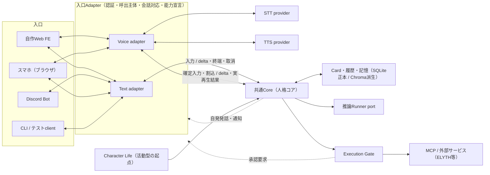

# 複数入口から同じ人格コアを利用する要件と最終構成（2026-09）

## 状態・適用範囲

**ACTIVE**。2026-09-26に#3の範囲確認で合意した要件と、将来の最終構成を記録する（同日の追加合意を§2〜§8へ反映）。
本ADRは要件・判断・不変条件を定める。実装・既定有効・dogfood受入を意味しない。
進捗・依存・完了条件は次のIssuesを正本とする。

| 範囲 | Issue |
|---|---|
| 共通Core呼出境界（既存Web・音声） | [#3](https://github.com/FYuki/digital-souls/issues/3) |
| 入口Adapter共通基盤（CLIで受入、Discordは優先度低） | [#516](https://github.com/FYuki/digital-souls/issues/516) |
| ELYTHへの自律参加 | [#517](https://github.com/FYuki/digital-souls/issues/517) |
| 記憶・履歴の公開範囲（#517より前に実装） | [#518](https://github.com/FYuki/digital-souls/issues/518) |
| 推論Runnerの差替え（Pydantic AI） | [#422](https://github.com/FYuki/digital-souls/issues/422) |

自律活動・外部送信・高影響操作は[Character Life共通契約](character-life-memory-personality-autonomy-2026-09.md)の§8〜§11を再利用する。
本ADRはそれらを再定義・緩和しない。

## 背景

キャラクターは自作Web FE（テキスト・音声）だけでなく、Discord、スマホ、CLI、SNS（ELYTH等）からも利用する。
どの入口から話しかけても「同じ子」として応答・行動することを目標とする。
複数の窓口を同じコアへつなぎ、記憶の出所で公開範囲を分けるという考え方は、
[OURIの設計紹介](https://note.com/ouri_chronicles/n/n8ab0737cf9d1)を参考にした。

## 要件

| # | 要件 | 合意内容 |
|---|---|---|
| R1 | 一つの人格コアを複数の入口から使う | 入口ごとに人格・記憶・権限を複製しない。入口の違いは表現手段と能力に限る |
| R2 | 対話型と活動型の入口 | SNS参加は自律で行う。利用開始はオーナーが承認し、その後の個々の行動は§5の制御で保証する |
| R3 | 記憶の公開範囲 | `public`／`private`の2段階。SNS対応（#517）より前に#518で実装する。公開の場では具体を含まないエピソードと会話外活動での経験を中心に使う |
| R4 | 相手の識別 | MVPは`owner`（ユーザー）と`other`（その他）の2種類。将来SNS等でIDがある相手は個別に識別できる構造にする |
| R5 | 入口をまたいだ一貫性 | ある入口での体験を、長期記憶を通じて他の入口の会話で使える（R3の範囲内）。会話スレッドは入口ごとに分ける |

## 1. 最終構成

以下は目標とする構成であり、現行実装ではない。現行の構成は[アーキテクチャ](../system-architecture.md)を参照する。



- Voice adapterは、現行のLiveKit transport＋自前の音声制御から、将来LiveKit Agents等へ差し替えられる。
  差替え時にCoreを変更しないため、Coreが受け取るのは確定した入力・割込・取消・実再生済み範囲に限り、
  発話区間検出・ターン判断・再生キューはVoice adapter側が所有する。#3ではLiveKit Agentsを導入しない。
- 推論Runner portは既存Inference Routerを包み、#422でPydantic AIへ差し替える。
- Discordのボイスチャットに対応する場合は2つ目のVoice adapterとし、STT／TTS providerを共有する。

## 2. 入口の分類

| 種類 | 例 | 起点 | 出力先 |
|---|---|---|---|
| 対話型 | Web、Discord、スマホ、CLI | 相手の入力 | 入力元の会話 |
| 活動型 | ELYTHの巡回・投稿・返信 | Character Life | Execution Gate経由の外部サービス |

活動型は会話の配送先ではない。Character LifeがCoreを呼び、外部への作用は必ずExecution Gateを通す。
自律runtimeからMCPを直接呼ばない（Character Life共通契約§11）。

### 2.1 入口と会話・認証（MVP）

| 項目 | 決定 |
|---|---|
| 会話スレッド | 入口ごとに分ける。WebはPCブラウザとスマホブラウザで共通の入口とし、同じスレッドを使える。入口をまたぐ共有は長期記憶を通じて行う |
| 入口Adapterの配置 | Backendと同一プロセスに置く（LiveKit transportと同じ扱い）。別プロセス向けの認証付きAPIは作らない |
| Webの認証 | tailnet（#514）へ到達できる利用者を`owner`とみなす。Backendには認証を追加しない。一般公開する場合はこの前提を見直す |
| 最初の非Web入口 | CLI。FEなしで同じCoreを呼べることをCLIで受け入れる。Discordは優先度低の後続入口とする |

## 3. 呼出主体

Coreへの呼出は次の主体を持つ。

```text
actor = { kind: owner | other | self, platform, external_id? }
```

- `owner`：オーナー。Webではtailnetへ到達できる利用者（§2.1）、Discord等では設定したオーナーIDだけを`owner`とする。
- `other`：それ以外の人間・AI。非信頼入力として扱い、prompt上でも区別する。`other`の発言からはキャラクター自身の経験としてのエピソード記憶だけを形成し、Fact・意味記憶・オーナーの嗜好は形成しない。
- `self`：活動型の呼出でキャラクター自身が起点の場合。
- MVPでは`external_id`を使った個別識別を行わないが、記録できる形にして後からのデータ移行を不要にする。
  個別の相手との関係はCharacter Life共通契約§7のRelationship Stateへ接続する。

## 4. 公開範囲

- 記憶・履歴は`public`／`private`、Coreへの呼出は出力先の公開範囲を持つ。
- 出力先が`public`なら`public`の記憶だけをpromptへ入れる。`private`なら両方を使える。LLMへの指示には頼らない。
- 派生する記憶（Semantic・Reflection・人格変化）の公開可否は、§4.1の世代規則で判定する。
- 公開の場（SNS等）で使う記憶は、具体（固有名詞・日時・場所・人物等）を含まないエピソードと、会話外活動（Character Life）での経験を中心とする。オーナーとの会話の具体的な内容は公開の場へ出さない。
- 長期記憶保存時の機微情報マスクは、公開範囲の代わりにならない。予定・勤務先・人間関係等の日常の個人情報はマスク対象外であるため、#518を#517より前に実装する。
- #518の実装までは記憶を全て`public`とみなし、公開の場への自律出力（#517）を有効化しない。

### 4.1 公開出力での記憶の扱い

「具体」は、オーナーとの会話に由来する固有名詞・日時・場所・人物等を指す。公開の場への出力では記憶の種類ごとに次のとおり扱う。

| 記憶 | 公開出力での扱い |
|---|---|
| Fact | オーナーとの会話由来は使わない |
| Episode | オーナーとの会話由来は、5Wを除き述語と気持ちに抽象化した形でのみ使う |
| 意味記憶（直接抽出） | オーナーとの会話由来は使わない |
| 意味記憶（経験から一般化）・Reflection | 下記の世代規則を満たすものだけを使う |
| Life State | 項目の種類と出典で判断する。共有候補等に具体を含むものは使わない |
| 会話外活動のEpisode・公開情報 | 使える（中心にする） |

**世代規則**：判定は出典・派生関係（provenance・lineage）から行い、再帰的な探索はしない。
参照する記憶自体（0世代）と、その根拠の1世代前・2世代前までに具体が含まれないことを条件とする。
3世代以上前は判定対象外とし、残るリスクは送信直前のEgress Privacy Check（Character Life共通契約§9）で補う。

MVPでは`public`／`private`の欄を新設せず、出典の種類（オーナーとの会話か、会話外活動・公開情報か）と上記規則で判定できるかを#518で確認する。
明示的な`private`の指定（秘密の話）は同じ判定へ後から追加する。

## 5. 自律的なSNS参加の制御

利用開始の承認は、該当connectionをAutonomy Targetとして許可する操作とする（Character Life共通契約§8）。
会話中の閲覧限定（#241）と自律活動での許可は別設定であり、会話中の制限を緩めない。
許可後の投稿・返信・いいね・フォローは自律実行し、次で制御する。
回数上限は安全装置としての値とし、通常の活動を妨げない範囲で固定する。

1. 公開の場への出力では`public`の記憶だけを使う（§4）。#518の実装前は有効化しない。
2. 送信直前のEgress Privacy Check。secretは常にBLOCK（同§9）。
3. Execution Gateの書き込み許可、回数上限・予算、監査ログ、緊急停止（pause・disable・revoke）。
4. High Impact操作は#185のConfirmationPolicyへ委譲（同§10）。
5. 結果不明の送信を未実行へ変換して再送しない（同§11）。

ELYTHにはテスト環境がないため、実送信の受入はdogfoodの本番経路で行う。
dev/testの自動テストでは実送信せず、模擬サーバー等で制御を確認する。

## 6. 不変条件

- 人格・記憶・履歴・権限・推論設定の正本は一つ。入口・SDK・FEの内部状態を第二の正本にしない。
- 共通CoreはFE・LiveKit・Discord・SNS固有の型へ依存しない。
- 外部への作用はExecution Gateを通す。入口Adapterや活動runtimeが独自の権限判断・Tool loopを持たない。
- 既存のprivacy・Egress・High Impact・結果回復の契約を、入口の追加を理由に緩和しない。

## 7. 実施順

```text
#3 共通Core呼出境界（既存Web・音声、CLIから呼べる契約）
  → #516 入口Adapter共通基盤（CLIで受入） ／ #518 公開範囲
  → #517 ELYTH自律参加（#518の後）
  → #422 Pydantic AI
```

Discord（#516の後続）は優先度低とし、上記の完了条件に含めない。

## 8. 対象外・未決事項

- 対象外：スマホのネイティブアプリ（当面は#514のブラウザ経由）、一般公開API、複数オーナー、3段階以上の公開範囲、Discordボイスチャット。
- 未決（#516）：承認UIのない入口で承認が必要な操作の扱い、複数入口からの同時会話、Discord Botが担当するキャラクター。
- 未決（#517）：起動条件と具体的な回数上限。
- 未決（#518）：非公開の入力の指定方法、会話エピソードから具体を除いた公開用表現の作り方、出典の種類による判定で足りるか。

## 用語

用語と実装名の対応は[用語集](../glossary.md)の「複数入口・公開範囲」を参照する。
用語集の`Character Core`はCardから組み立てるprompt領域を指す既存語であり、本ADRの「共通Core（人格コア）」とは別である。
